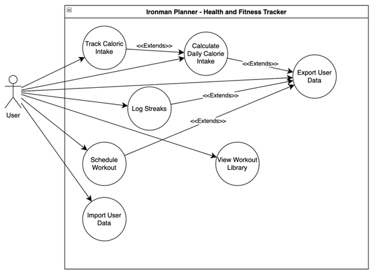
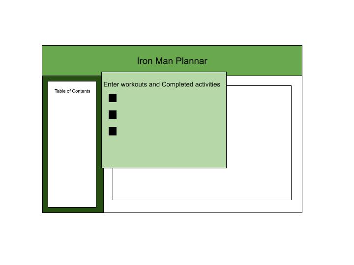
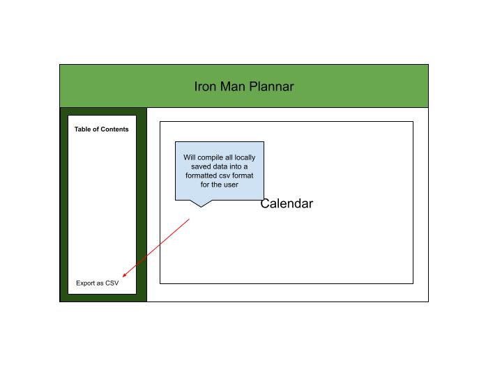
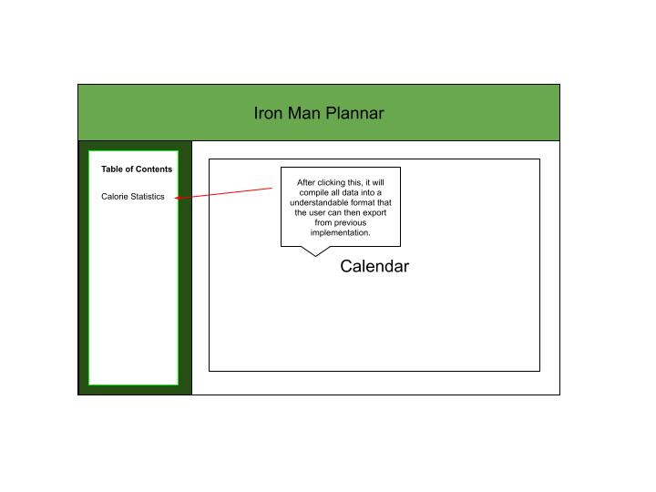
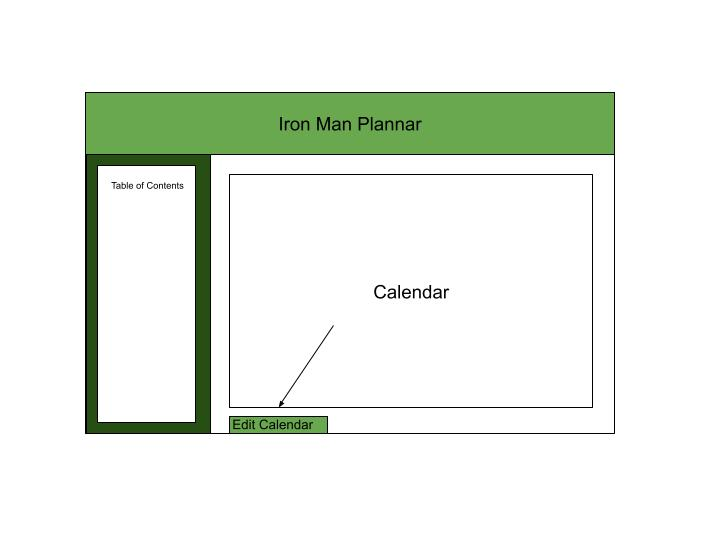
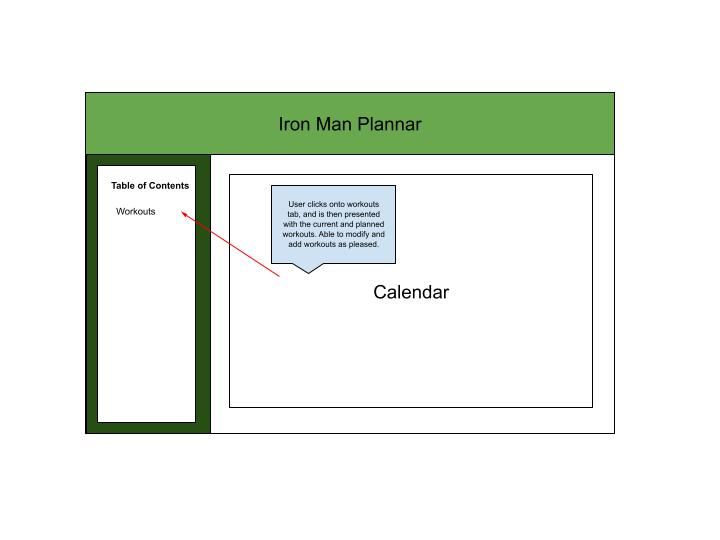
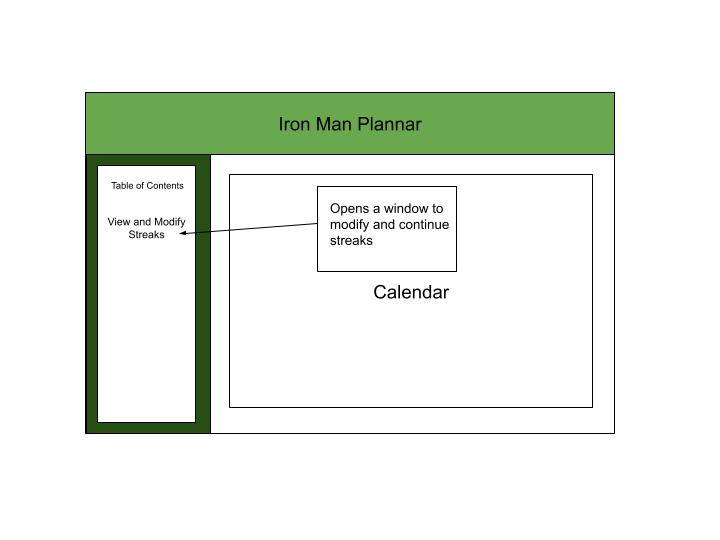
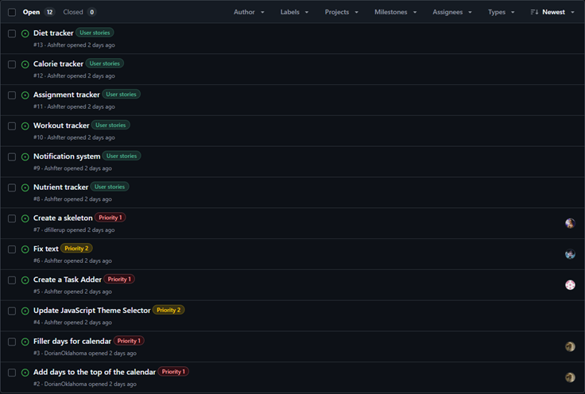

# Deliverable 2 \- Iron Man Planner

Cole Bishop, Dorian Sanchez, Daniel Fillerup, Travian Lenox, James, Jesse

---

### 1\. Positioning

#### **Problem statement**

The problem of a lack of dedicated health-tracking software for the most hardcore fitness enthusiasts affects athletes, Ironman triathletes, and individuals who seek to gamify and micromanage every aspect of their health and fitness. The impact is frustration with generic fitness apps that fail to meet their advanced needs, forcing them to juggle multiple tools instead of having a comprehensive, all-in-one solution. This can lead to health enthusiasts taking more time and spending more money just to fall short of their health and fitness goals because they do not have the best tool at their disposal to guide them on the most efficient health journey.

#### **Product Position Statement**

For athletes, Ironman triathletes, and individuals who seek to gamify and micromanage every aspect of their fitness journey who are in need of an efficient and fun way to track their health and eating habits. Our IronMan Planner is an all-in-one fitness and nutrition tracker that aims to migrate all desirable functionality that an individual could desire into one central hub. Unlike our competitors Strava, Google Fit, and MyFitnessPal our product is easily accessible and has an extreme focus on data privacy with all user data being stored locally with options for them to handle their saved data however they like.

#### **Value proposition and customer segment**

Value proposition: The Iron Man Planner is a fitness and nutrition tracker that allows groups such as athletes, trainers, and health \- conscious people to efficiently manage aspects of their fitness tasks by integrating all of these key elements into a single platform.

Consumer segment: Athletes, Iron Man trainers, and people who are engaged with fitness who want to micromanage and organize their health and fitness tasks. 

### 2\. Stakeholders

**Stakeholder 1: Users**

**Description** \- The expected users would be athletes and people who emphasize their physical health. The users will be directly using the planner to track different aspects such as fitness calendar, nutrition, calorie intake, etc. The users can range from professional to lifestyle athletes who prioritize their fitness and want a more efficient way to monitor their journey.

**Responsibilities** \- The user’s responsibilities are to give feedback to us so that we can directly make improvements to the program. This feedback is also crucial in adding new features and applying improvements to already existing functions. 

**Stakeholder 2: Competitors**

**Description** \- The competitors include the companies or developers that are creating or have already developed fitness tracking applications. Some known names are Strava, Google Fit, and MyFitnessPal.

**Responsibilities** \- These competitors can help with customer response based on our program’s user population leaving or joining. The competitors also have set a standard that our team can review whether it is improvements or disadvantages within their program. 

**Stakeholder 3: Trainers**

**Description \-** The trainers would be personal fitness trainers whether they do it on the side or for a full time job. Trainers will be using the website to track their workout plans and when they have customers showing up for these plans.

**Responsibilities** \- The trainers responsibilities are to give us feedback on how to improve the functionality of the workout tracker, and scheduling system for clients.

### 3\. Functional requirements (features)

1. **Calorie Counter** \- A place where the user can add the calorie count of everything they eat in a day to see if they stay under their recommended daily intake. Count resets every day back to 0

2. **Daily Calorie Intake Calculator** \- A formula that takes in the users, age, height, sex and other factors to determine how many calories in a day they should be eating.

3. **Calendar** \- A grid layout calendar that shows you what tasks you have planned for each day and helps you stay organized

4. **Scheduler** \- A system that allows the user to create tasks for specific dates and times along with a description of the activity

5. **To-Do List** \- A generic to do list where less pressing tasks are meant to be put (Similar to short term reminders instead of schedules appointments)

6. **Workout Planner** \- System that allows you to pick an assortment of workouts and put them all together into one collection.

7. **Workout Library** \- List of workouts you can do containing a description of each workout, what part of your body it is training, and its expected calorie burn.

8. **Workout Equivalency** \- If you want to be able to mimic an exercise that would regularly be done at a gym, allow for a substitute to be done at home.

9. **Save file export and load feature** \- Store the users data in cookies but allow them the option to export their data to a separate file then load that file back into the cookies in their web browser. (This way if they want to clear cookies, they can still retain their information)

10. **Streak feature** \- If the user stays consistent with meeting their exercise goal and staying within their daily calorie intake then have a streak counter startup that increases by one for each day gained.

### 4\. Non-functional requirements

1. **Satisfaction** \- The website will let the user know directly what their actions do in the website, responsiveness.

   1. **Goal** \- 9 out of 10 surveyed users report a positive, difficulty free experience using the website.

2. **Availability** \- The website must always be available to users and immune to any inconvenience

   1. **Goal** \- Users are able to install the web app locally so that it is always accessible to them even when internet access is limited

3. **Context Coverage** \- The web app functions well on a variety of modern browsers and screen sizes. User interface will always be readable and adapt to different screen sizes to maintain intractability. 

   1. **Goal** \- Custom UI layouts will be made for different device formats (Phone, Tablet, Computer) and 8/10 users should say that the UI is easy to understand for each format. 

4. **Efficiency** \- The app should run smoothly and no functionality should have a noticeable stutter

   1. **Goal** \- Review all functions for further optimizations and the web will never stutter/pause during usage.

5. **Freedom From Risk** \- The app should minimize any risk to user safety, cost, or health impacts

   1. **Goal** \- The app will ensure safety by storing all user data locally, minimize cost by being free, and avoid health risks by providing a warning if users set their daily calorie intake below 1,500

### 5\. Minimum Viable Product

**MVP Features:**

1. **Saving** \- let the user save their data (events, calorie intake goal, fitness history…)  
2. **Calorie Tracker** \- Let the user input calories for everything they eat and a daily calorie intake goal for them to aim for  
3. **To-Do List** \- A place where the user can enter things they want to get done or reminders  
4. **Calender** \- A place where the user can enter events with a specific date or time of completion  
5. **Workout Library** \- A list of workouts the user can do that each have a description to instruct the user on how to do them and an estimate of how many calories they will burn by doing the workout.

**MVP Testing**

1. **Scripted Test** \- A step by step validation of all the possible actions you can do within each of the features to look for unexpected behavior or issues  
2. **User Testing** \- Building prototypes and sending them to potential users so they can use them for a time and provide us with feedback  
3. **Accuracy Testing \-** Validation of data like the expected calorie burn for workouts by comparing estimates in trusted fitness data

We consider a minimal viable product to be a webpage with saving functionality, a daily calorie tracker with the option to put in a recommended daily calorie intake value, to do list functionality, basic calendar functionality that lets you place events on certain days, and a workout library with estimate for how many calories each workout may burn. To test each of these features we will use a mixture of different methods, first being a scripted test where we go through all possible interactions with these features looking for errors or bugs, second being a user test where we send prototypes to potential users so they can use them over a period of time and provide feedback, and finally we will test the accuracy of features like the expected calorie burn for workouts by comparing with trusted fitness data. 

### 6\. Use cases

**Use case 1:** Track daily fitness and goals

**Actor:** User

**Trigger:** User begins their tracking session

**Pre-conditions:**

* User entered required information

**Post-conditions:**

* User successfully tracks their goals and fitness  
* progress is updated

**Description:**

A user enters in their workouts and activities for the day to be counted in their fitness history

1. User selects “record activity” button  
2. A window prompting the user to enter workouts and activities appears with an empty list and button saying “add”  
3. The user selects add  
4. A window showing 2 options, “select from workout library” or “enter manually” appears  
5. User selects “select from library”  
6. A window showing the users workout library appears, letting them pick preexisting workouts with set “calories burned” amounts  
7. The user selects a workout from the list, the window disappears, and the user selects add, then “enter manually”  
8. A window appears letting the user enter a name for the activity, a description, and a number of calories burned  
9. The user fills in the data, enters the activity into the list and submits the list so that the activities are recorded.

—-----------------------------------------------------------------------

**Use case 2:** Export Fitness Data

**Actor:** User

**Trigger:** User tries to export their data

**Pre-conditions:**

* User is done with fitness tracking and goals

**Post-conditions:**

* Data is saved to a file  
* Data can be loaded later

**Description:**

A user saves their fitness data to a separate CSV file

1. User selects “Export as CSV”  
2. A file explorer window appears, letting the user select where they want to save the data and what it should be called.  
3. The user selects a location and name then selects save  
4. The iron man planner takes all user data currently stored in cookies and writes it into a CSV file.

—-----------------------------------------------------------------------

**Use Case 3:** Calculate daily calorie intake 

**Actor:** User

**Trigger**: User accesses the Calorie Calculator

**Pre-conditions:**

* Necessary info is inputted

**Post-conditions:**

* Calculates calorie intake and suggests recommended intake value to the user

**Description:**

A user sets their recommended daily calorie intake

1. User selects “calorie statistics”  
2. A window appears showing all the users calorie data if there is any and a button saying “set daily calorie goal”  
3. The user selects “set daily calorie goal”  
4. A window appears where the user can enter their age, gender, height, weight, and average activity amount along with a separate section with a button “Enter calorie goal manually”  
5. The user enters all their data and presses “calculate”  
6. The information is entered into a formula behind the scenes and after calculation is complete, a popup window saying “Daily Calorie Goal Set to” followed by the final result appears.

 

—-----------------------------------------------------------------------

**Use Case 4:** Create schedule and workout plan

**Actor:** User

**Trigger:** User wants to schedule a new workout

**Pre-conditions:**

* Required information is available

**Post-conditions:**

* User created a new workout plan into the calendar

**Description:**

A User Schedules a time to go to the gym and plans a workout

1. The user selects “edit calendar”  
2. A window appears asking them what day they want to add to  
3. The user selects a day  
4. A window asking the user if this is an event or workout appears  
5. The user selects workout  
6. A menu with options for a location, time, and area to add workouts appears  
7. User enters location, time and selects workout section  
8. A screen displaying their workout library appears  
9. The user selects workouts from the library  
10. The user selects “done” to add the workout to their calendar

—-----------------------------------------------------------------------

**Use Case 5:** Modify/Change Workout Library

**Actor:** User

**Trigger:** User modifies their available workouts

**Pre-conditions:**

* User has workouts stored

**Post-conditions:**

* User viewed and/or modified the workouts

**Description:**

A trainer’s client is running a bit late to their session and needs to modify that client's workout for the day.

1. The user selects edit calendar  
2. A popup asking for the date they wish to edit  
3. A list of workouts currently set for the day shows up with selectable buttons next to each workout  
4. Selecting edit brings up a menu similar to the menu to create workouts allowing user to change anything within the workout details or delete the workout as a whole  
5. A series of save buttons for workout, day, and calendar as a whole.  
6. After save is selected the calendar updates with the new information

—-----------------------------------------------------------------------

**Use Case 6:** Manage workout streak

**Actor:** User

**Trigger:** User tracks workout and goals

**Pre-conditions:**

* User entered their workout and goals

**Post-Conditions:**

* User streak counter is updated

**Description:**

A User wants to add a day to their streak.

1. User presses view and modify streaks  
2. A window appears asking if they want to add a day to their streak or change previous days  
3. Users select to add a day or change previous days.   
4. If added, a day is added. If it changes, it asks for which day.  
5. When a day is selected, users can change whether they added to the streak that day or not.  
6. User selects done and the window closes

### 7\. User stories

**Jesse** :

User Story 1: As a health-tracker, I want to be able to see how many calories I’ve lost total so I can see my progress since I started.

Priority Level: 2

Expected Hours of Work: 2

User Story 2: As a vegetarian, I want to be able to add meals to the calorie counter based on my specific diet.

Priority Level: 3

Expected Hours of Work: 4

 

**James**: 

User Story 3: As a fitness enthusiast, I want to be able to track my data for specific nutrients like sodium and fiber intake so that I can adjust my diet.

Priority Level: 1

Expected Hours of Work: 10

User Story 4: As a developer, I want to implement notifications for goals and certain data so that users are more engaged and motivated to use the app.

Priority Level: 2

Expected Hours or Work: 12

**Daniel**:

User Story 5: As an Ironman Triathlete I would like to schedule my upcoming marathons so that I am able to prepare for them adequately. 

Priority Level: 3

Expected Hours of Work: 5

User Story 6: As a busy single mom I would like to be able to track my meals without the hassle that comes with most dieting apps so that I can work towards my weight loss goals.

Priority Level: 2

Expected Hours or Work: 8

**Travian**: 

User Story 7: As a gym rat I want to be able to track my workout sets so that I can keep track of progress maybe with pictures as well

Priority Level: 3

Expected Hours of Work: 8

User Story 8: As a student I would like to be able to keep track of assignments and what’s due soon

Priority Level: 2

Expected Hours or Work: 6

**Cole:**

User Story 9: As a trainer I want to be able to have my clients send me their data from the application so I can review it and make adjustments to their routine.

Priority Level: 4

Expected Hours of Work: 7

User Story 10: As an analyst I want to be able to monitor health trends among fitness enthusiasts that are of interest to 3rd party services

Priority Level: 5

Expected Hours or Work: 15

**Dorian:**

User Story 11: As a Sumo wrestler I want to be able to hit my goals so I can maintain a competitive advantage

Priority Level: 3

Expected Hours of Work: 7

User Story 12: As a competitive athlete, I want to receive performance and progress reports so that I can use the data to adjust my training.

Priority Level: 4

Expected Hours or Work: 10

### 8\. Issue Tracker

[https://github.com/Oracle451/Personal-Planner/issues](https://github.com/Oracle451/Personal-Planner/issues)

