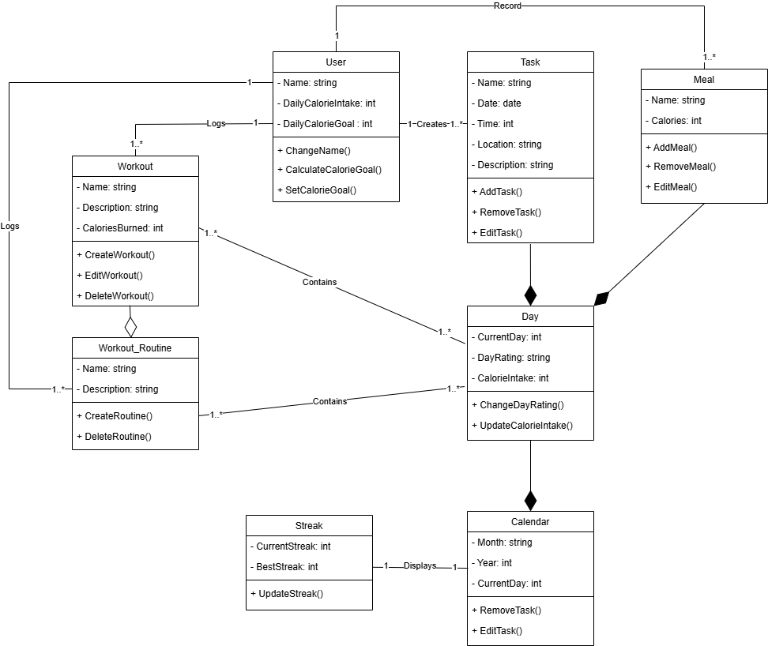

# Deliverable 3 \- Iron Man Planner

Cole Bishop, Dorian Sanchez, Daniel Fillerup, Travian Lenox, James, Jesse

---

### System Description

The problem of a lack of dedicated health-tracking software for the most hardcore fitness enthusiasts affects athletes, Ironman Triathletes, and **users** who seek to gamify and micromanage every aspect of their health and fitness. The impact is frustration with generic fitness apps that fail to meet their advanced needs, forcing them to juggle multiple tools instead of having a comprehensive, all-in-one solution. This can lead to health enthusiasts taking more time and spending more money just to fall short of their health and fitness goals because they do not have the best tool at their disposal to guide them on the most efficient health journey. Our IronMan Planner is an all-in-one fitness and nutrition tracker that aims to migrate all desirable functionality that a **user** could want into one central hub. Unlike our competitors, Strava, Google Fit, and MyFitnessPal, our product is easily accessible and has an extreme focus on data privacy, with all user data being stored locally with options for them to handle their saved data however they like. We allow Athletes, Trainers, and Health-Conscious People to efficiently manage all aspects of their health journey in a single platform.

Our application aims to provide a comprehensive fitness and organization tool, integrating key features that enhance user experience and goal tracking. The core requirements include a saving system that allows users to store their data (such as **tasks**, *calorie intake goals*, and workout history. A *calorie* tracker will enable users to ***log*** their *daily calorie intake* while setting a *daily calorie goal*. A to-do list will provide a space for users to ***log*** down **tasks** and reminders, while a **calendar** will help schedule **tasks** with specific *dates and times*. Additionally, a **workout library** will offer a collection of **workouts**, each with *descriptions* and *estimated calories burned* to guide users in their fitness journey.

Beyond these core features, the app will include a *calorie* counter to track *daily calorie intake*, resetting each day, and a daily *calorie* Intake calculator that uses age, height, and sex to determine recommended consumption. A **calendar** and scheduler will organize **tasks** efficiently, while a **workout routine** will allow users to ***log*** multiple **workouts** into a structured plan. The **workout library** will detail each **workout**, specifying target muscle groups and *calories burned*, and a workout equivalency feature will suggest home-based alternatives for gym exercises. To ensure data persistence, users can export and load their save files, preventing data loss when clearing browser cookies. Lastly, a **streak feature** will reward consistency by tracking progress when users consistently meet their fitness and dietary goals, reinforcing motivation and accountability.

### UML Class Diagram Model

### Teamwork

Cole Bishop (17%) \- Added clear cookies button to the website and wrote up the system description. 

Dorian Sanchez (17%) \- Make UI mockups for complete functionality planning

Daniel Fillerup (22%) \- Bolded/Italicized key terms in system description and led the building process for our UML class diagram

Travian Lenox (17%) \- Made a drop down menu for the theme selector and clear cookies

Jesse (17%) \- Made progress on the website, added necessary functions (Change month feature, task visualization) and cleaned up old code. Also made quality of life improvements for the development side. 

James (10%) \- Made a new theme for the site and added a calorie tracker function.