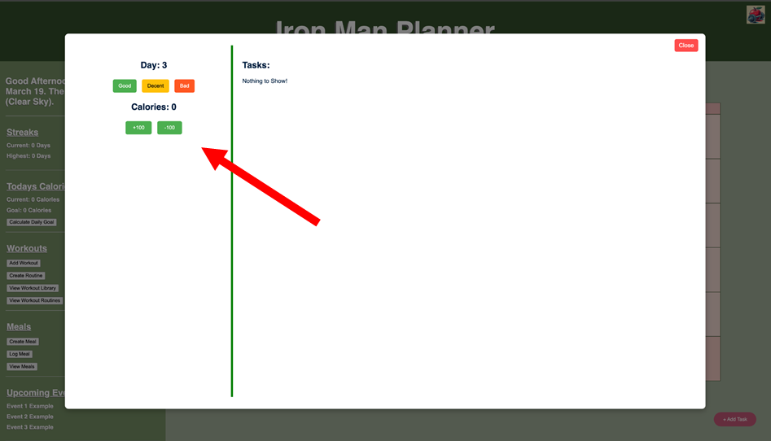
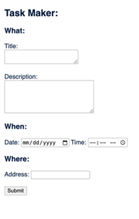
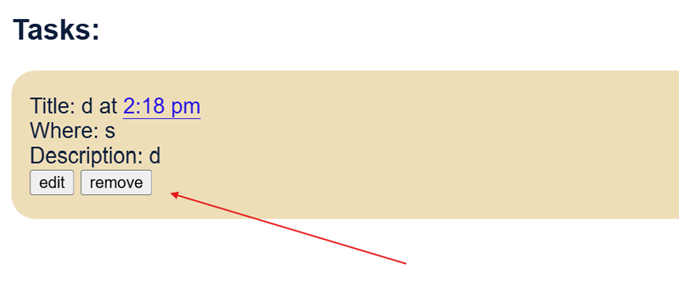
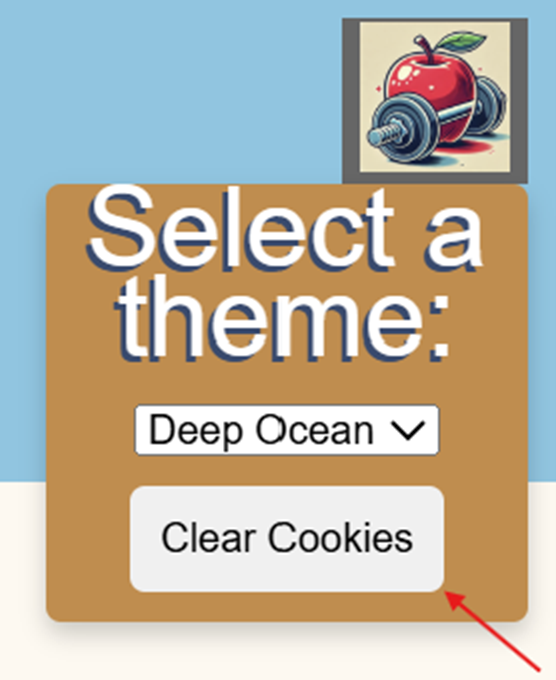
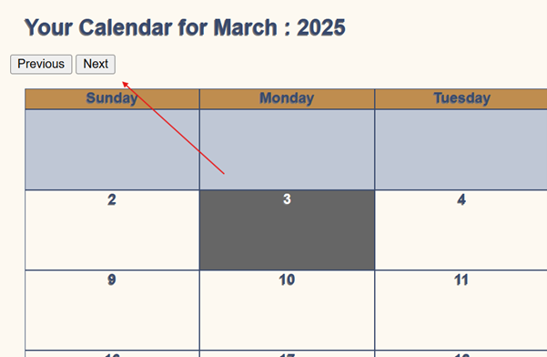
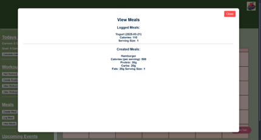
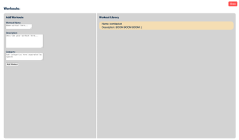
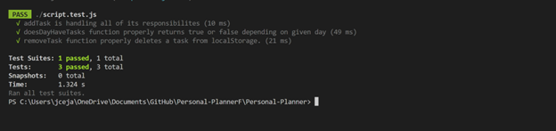
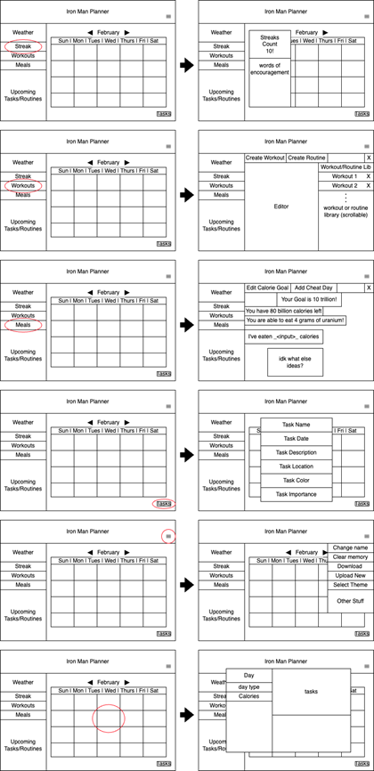
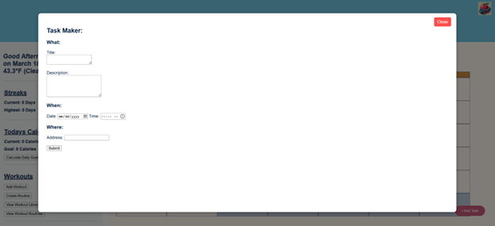

# Deliverable 4 \- Iron Man Planner

Cole Bishop, Dorian Sanchez, Daniel Fillerup, Travian Lenox, James, Jesse

---

### Introduction

The Iron Man Planner is a fitness and nutrition tracker that allows groups such as athletes, trainers, and health conscious people to efficiently manage aspects of their fitness tasks by integrating all of these key elements into a single platform. Our planner will include a calorie goal calculator and functionality to let you track your daily calories in hopes of meeting your goal. It will also have a calendar that allows the user to schedule events and plan workouts. To motivate users to keep up on their health journey we have a streak feature that tracks how long they have been consistent with using the planner. Finally, for data privacy we will give users complete control over their information by letting them clear cookies stored by the website anytime they like. 

[Iron Man Planner Github](https://github.com/Oracle451/Personal-Planner)

### Requirements

Requirement: As a health-tracker, I want to be able to see how many calories I’ve lost total so I can see my progress since I started.  
Issue: [https://github.com/Oracle451/Personal-Planner/issues/12](https://github.com/Oracle451/Personal-Planner/issues/12)   
Pull request: [https://github.com/Oracle451/Personal-Planner/pull/29](https://github.com/Oracle451/Personal-Planner/pull/29)   
Implemented by: James Nguyen  
Approved by:  Daniel Fillerup  
Print screen:

Requirement:User Story: As an organized person, I want to be able to add custom tasks to my calendar.  
Issue: [https://github.com/Oracle451/Personal-Planner/issues/15](https://github.com/Oracle451/Personal-Planner/issues/15)   
Pull request: [https://github.com/Oracle451/Personal-Planner/commit/58a7bd1fbf68231ac9401599d43e72356b272d5a](https://github.com/Oracle451/Personal-Planner/commit/58a7bd1fbf68231ac9401599d43e72356b272d5a)   
Implemented by: Jesse Ceja  
Approved by: Jesse Ceja  
Print screen:

Requirement: As a businessman with a hectic schedule I want to be able to remove events so that if something is canceled, my calendar can reflect that.  
Issue: [Task Removing · Issue \#47 · Oracle451/Personal-Planner](https://github.com/Oracle451/Personal-Planner/issues/47)  
Pull request: [Task functions overhaul · Oracle451/Personal-Planner@782236b](https://github.com/Oracle451/Personal-Planner/commit/782236b523eeb2a0b111a0b083047cb44d457b43)  
Implemented by: Jesse Ceja  
Approved by: Daniel Fillerup  
Print screen: 

Requirement: As a very security centric person, I want to be able to clear all my stored data at a moment's notice so that I can be sure of my privacy.  
Issue: [Clear Cookies Button · Issue \#52 · Oracle451/Personal-Planner](https://github.com/Oracle451/Personal-Planner/issues/52)  
Pull request: [Added Clear Cookies Button · Oracle451/Personal-Planner@04d9ec5](https://github.com/Oracle451/Personal-Planner/commit/04d9ec55b9e81e8c82ad8fd9c4ccbcb8ec284fee)  
Implemented by: Cole Bishop  
Approved by: Cole Bishop  
Print screen: 

Requirement: As a triathlete with athletic events coming up all throughout the year, I want to be able to plan months into the future so that my schedule is filled out as far as I need it.  
Issue: [Change Month Feature · Issue \#53 · Oracle451/Personal-Planner](https://github.com/Oracle451/Personal-Planner/issues/53)  
Pull request: [Added Changing Month Functionality · Oracle451/Personal-Planner@2e3db1c](https://github.com/Oracle451/Personal-Planner/commit/2e3db1c1a3b826f7ec50ab73a1b8b3bcdb0d72d4)  
Implemented by: Jesse Ceja  
Approved by: Jesse Ceja  
Print screen: 

Requirement: As a vegetarian, I want to be able to add meals based on my specific diet.  
Issue: [https://github.com/Oracle451/Personal-Planner/issues/13](https://github.com/Oracle451/Personal-Planner/issues/13)   
Pull request: [https://github.com/Oracle451/Personal-Planner/pull/55](https://github.com/Oracle451/Personal-Planner/pull/55)   
Implemented by: James Nguyen  
Approved by: Daniel Fillerup  
Print screen: 

Requirement: s a gym rat I want to be able to track my workout sets so that I can keep track of progress, maybe with pictures as well.  
Issue: [https://github.com/Oracle451/Personal-Planner/issues/10](https://github.com/Oracle451/Personal-Planner/issues/10)   
Pull request: [https://github.com/Oracle451/Personal-Planner/pull/64](https://github.com/Oracle451/Personal-Planner/pull/64)   
Implemented by: Dorian Sanchez  
Approved by: Cole Bishop  
Print screen:

Requirement: As a student who wants individuality, I want to customize the theme of my planner  
Issue: [https://github.com/Oracle451/Personal-Planner/issues/4](https://github.com/Oracle451/Personal-Planner/issues/4)    
Pull request: [https://github.com/Oracle451/Personal-Planner/commit/0172fa22e3ee44a6e91b8bb2cf0373dc7d537691](https://github.com/Oracle451/Personal-Planner/commit/0172fa22e3ee44a6e91b8bb2cf0373dc7d537691)   
Implemented by: Travian Lenox  
Approved by: Daniel Fillerup  
Print screen:

### Tests

Test Framework: Jest

Test 1: AddTask is handling it’s responsibilities  
Description: AddTask is expected to complete two things for each day it’s called on. For a given day, it is expected to save the task information to localStorage, and increment taskAmount and save it in localStorage,

Test 2: doesDayHaveTasks properly returns a true or false boolean depending on a given dateString by accessing localStorage.

Test 3: removeTask properly deletes data for it’s given task in localStorage

Github link to [script.test.js](https://github.com/Oracle451/Personal-Planner/blob/main/script.test.js), where the automated test code is.  
Githublink to [script.js](https://github.com/Oracle451/Personal-Planner/blob/main/script.js), the script being tested, specifically functions:  
addTask();  
removeTask();  
doesDayHaveTasks();

### Technology

1. HTML \- We chose HTML and to design a website in general because of the wide compatibility and ease of access for users (Everyone has a web browser). HTML is being used to create the general structure and backbone of our website so that JavaScript and CSS can build off of it.   
2. CSS \- This language is used to provide visual modifications and styling to HTML. We are using it to create a unique visual look to our website and implement the theme select.  
3. JavaScript \- This is a language that allows us all of the features of a traditional programming language while integrating well with HTML and CSS. We are using JavaScript to build logic and store data for many of the features we want to implement.

### Deployment

We are deploying the system using Digital Ocean for free thanks to a student credit. This server tier should be more than enough for our needs to host each release of our website. Alternatively, users can locally host the website by downloading the codebase from our GitHub repository. Below you will find a link to our hosted website.

[Iron Man Planner](https://personal-planner-kcjh2.ondigitalocean.app/?title=221&desc=12&date=2025-02-26&time=14%3A23&location=21https://personal-planner-kcjh2.ondigitalocean.app/?title=221&desc=12&date=2025-02-26&time=14%3A23&location=21)

### Licensing

We chose to use an MIT license because of its simple and complete open source nature. This way anyone can take our codebase and improve on it or build entirely new projects. A description of the license can be found below or a link to our license in our github can be found in the README File section.

[MIT License](https://choosealicense.com/licenses/mit/)

### Readme File

[Readme File Link](https://github.com/Oracle451/Personal-Planner/blob/main/README.md)

[Contributing File Link](https://github.com/Oracle451/Personal-Planner/blob/main/CONTRIBUTING.md)

[License File Link](https://github.com/Oracle451/Personal-Planner/blob/main/LICENSE.txt)

[Code Of Conduct File Link](https://github.com/Oracle451/Personal-Planner/blob/main/CODE_OF_CONDUCT.md)

### UX Design

For our UI design we chose to have the calendar be the primary focus in the middle with a sidebar on the left for most utilities. Each day in the calendar can be selected to show its events, calories, and rating. A button for adding events has been placed on its own in the bottom right because of its importance. General features like meals, workouts, and calorie monitoring are in the sidebar while features that have more to do with metadata can be found by hovering over the icon in the top right.

The Set of UI mockups below was used to get a general idea of what we wanted the system to look like and for us to figure out how the exact functionality should behave.

### Lessons Learned

Developing a set plan on how the finished product should look and function is crucial so that the team is all on the same page and you don't end up with conflicting contributions that need to be resolved later. We decided to do this after some conflicts in our individual plans for the product arose and when it came time to build a decisive vision we found that creating mock ups of the UI with set “action paths” showing what the user could do were the best way of going about it. We also learned how easy it is to fall into the trap of over promising features that you cannot reasonably deliver on in the given timeframe. To resolve this it is important to decide on 3-4 key features or “pillars” of your product that all have their own reasonable scope and measurable completion. Going forward we will fix these issues by always putting new features through a mock up phase where as a group we come to an agreement on appearance and functionality. We will also attempt to stick closely to our 3 pillars being the calendar, calorie tracking, and workouts so that we end with a focused product that executes each pillar well.

Problem 1: Conflicting visions on appearance and functionality.

Solution: Have a meeting where we build a mock up for look and feel that we can all agree on for new features.

Problem 2: Overpromising Features and spreading ourselves too thin.

Solution: Focus on 3-4 core pillars that we have measurable goals for and can execute well.

### Demo

[https://youtu.be/1OCaoQj7Dj0](https://youtu.be/1OCaoQj7Dj0) 

### Teamwork

Cole Bishop (18%) \- Introduction, Licensing, Readme File, and Lessons Learned sections

Dorian Sanchez (18%) \- Technology Section, UX Design sections

Daniel Fillerup (15%) \- Quality Control; Approved and managed pull requests to prevent conflicts

Travian Lenox (16%) \- Recorded Demo Video

Jesse (18%) \- Created Tests for JavaScript functions and Set up Website Hosting

James (15%) \- Created Functionality for the Meal section of the sidebar
