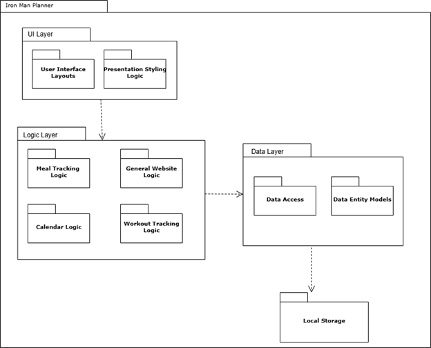
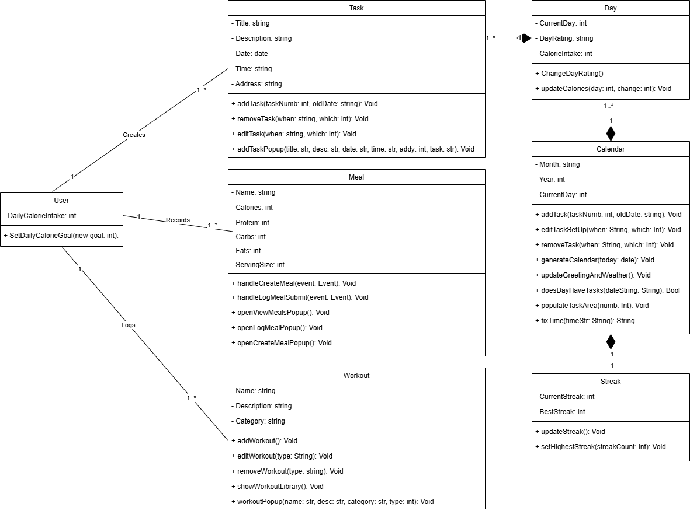
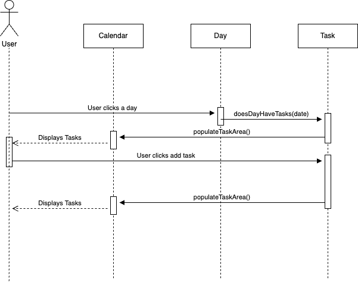
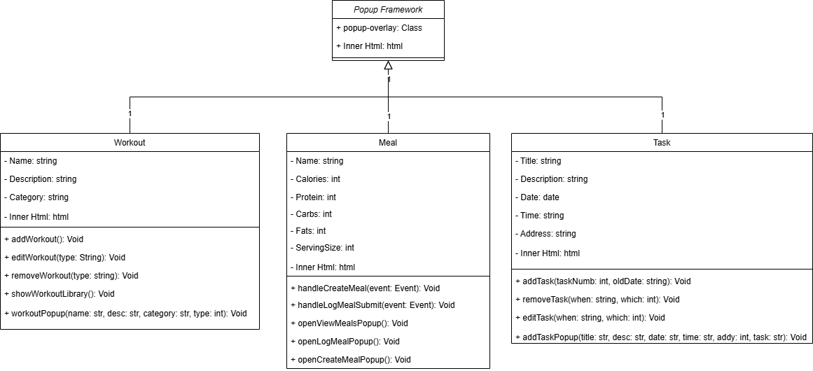
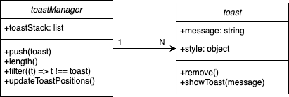

# Deliverable 5 \- Iron Man Planner

Cole Bishop, Dorian Sanchez, Daniel Fillerup, Travian Lenox, James Nguyen, Jesse Ceja

---

### Description

The Iron Man Planner is a fitness and nutrition tracker that allows groups such as athletes, trainers, and health conscious people to efficiently manage aspects of their fitness tasks by integrating all of these key elements into a single platform. Our design decisions revolved around the idea that this product goal could be achieved through 3 main pillars: meal tracking/calorie counting, task scheduling, and workout building/ logging. To facilitate this design choice we decided it would be best to design the UI around 3 main components, the calendar which takes up the majority of the screen since it is where all of your planning and tasks will appear, a sidebar which acts as a central control panel where most of the websites utilities can be found, and finally the ever present “Add Task” button which is always accessible due to its importance. We feel that the current design keeps the website simple and easy for users to use efficiently.

In the current release, we have implemented key features across all three pillars of the planner. For task scheduling, users can add tasks to specific days using the “Add Task” button and can view, edit, or remove tasks by selecting a day from the calendar. In the meal tracking section, users can create meals, log them to specific days, and adjust the total calorie count for each day to support accurate tracking. The workout tracking feature allows users to build a personal library of workouts, each with an estimated calorie burn listed in the description, and provides the ability to edit or remove workouts after creation. To enhance user engagement, we’ve introduced a streak system that motivates users to log information daily. Additionally, a user-friendly options menu in the top-right corner includes a theme selector for personalization and a clear cookies button to ensure transparency and user control over their data. Overall, Release 1 establishes a solid foundation of features that we are proud of and excited to continue building upon in future updates.

### Architecture

Our package diagram contains 3 main layers: the user interface layer, logic layer, and data layer. We decided on this because the UI is the top level at which the user interacts with our system and contained in it are the various HTML layouts and the CSS classes that determine how they look. Below the UI layer we have our logic handled by our logic which can be broken down into the primary use cases like meal tracking, workout planning, calendar usage etc. Finally under the logic layer we have the data layer where we construct objects that tell the system how to store the data in local storage and we have the data access methods that place and retrieve data. 

### Class Diagrams

### Sequence Diagrams

**Use case: User checks their tasks and adds a task**

**Actor:** User

**Trigger:** User clicks a day and add task

**Pre-conditions:**

* Calendar is displayed

**Post-conditions:**

* User sees the current tasks  
* a task is added to the task list

**Description:**

A user checks the current tasks they have then adds a new task to the existing list

1. User selects a day to view their tasks  
2. A window showing the current tasks is displayed  
3. The user fills out information relating to a new task  
4. User selects add task button  
5. The task is added to the list of current tasks  
6. The task list is updated to show the current list of tasks

### Design Patterns

### Section 1: Template Pattern

Workout \- [https://github.com/Oracle451/Personal-Planner/blob/main/workout.js](https://github.com/Oracle451/Personal-Planner/blob/main/workout.js) 

Meals \- [https://github.com/Oracle451/Personal-Planner/blob/main/meals.js](https://github.com/Oracle451/Personal-Planner/blob/main/meals.js) 

Task \- [https://github.com/Oracle451/Personal-Planner/blob/main/task.js](https://github.com/Oracle451/Personal-Planner/blob/main/script.js) 

Popup \- [https://github.com/Oracle451/Personal-Planner/blob/main/index.html](https://github.com/Oracle451/Personal-Planner/blob/main/index.html)

### Section 2: Singleton Pattern

ToastStack \- [Personal-Planner/script.js at main · Oracle451/Personal-Planner](https://github.com/Oracle451/Personal-Planner/blob/main/script.js)

UpdateToastPositions \- [Personal-Planner/script.js at main · Oracle451/Personal-Planner](https://github.com/Oracle451/Personal-Planner/blob/main/script.js)

ShowToast \- [Personal-Planner/script.js at main · Oracle451/Personal-Planner](https://github.com/Oracle451/Personal-Planner/blob/main/script.js)

### Design Principles

Single Responsibility Principle \- A class or function should have a single well defined responsibility.

Observation \- The showToast function in our script.js file has the sole well defined task of displaying a toast message that contains text it was passed.

Open/Closed Principle \- Entities like classes and functions should be open to extension while being closed to modification.

Observation \- In our JavaScript code, the applyTheme function is closed to modification but can be extended by passing in different color classes to the function for the function to apply them as a theme

Interface Segregation Principle \- A class should not depend on any components it does not use to promote smaller focused interfaces over large general ones.

Observation \- All of our button classes are separate from larger classes like the calendar and sidebar so they have no reliances on the functions related to creating and modifying tasks, they are self contained.

### Teamwork

* Cole Bishop (20%) \- Completed Description, Design Patterns, and Design Principles Sections.  
* Dorian Sanchez (20%) \- Did the Design Patterns and Sequence Diagram Sections.  
* Daniel Fillerup (17%) \- Created the Class Diagram  
* Travian Lenox (17%) \- Made the UML Package Diagram  
* Jesse (14%)- Wrote the description for the UML Package Diagram  
* James (12%) \- Helped with UI overhaul